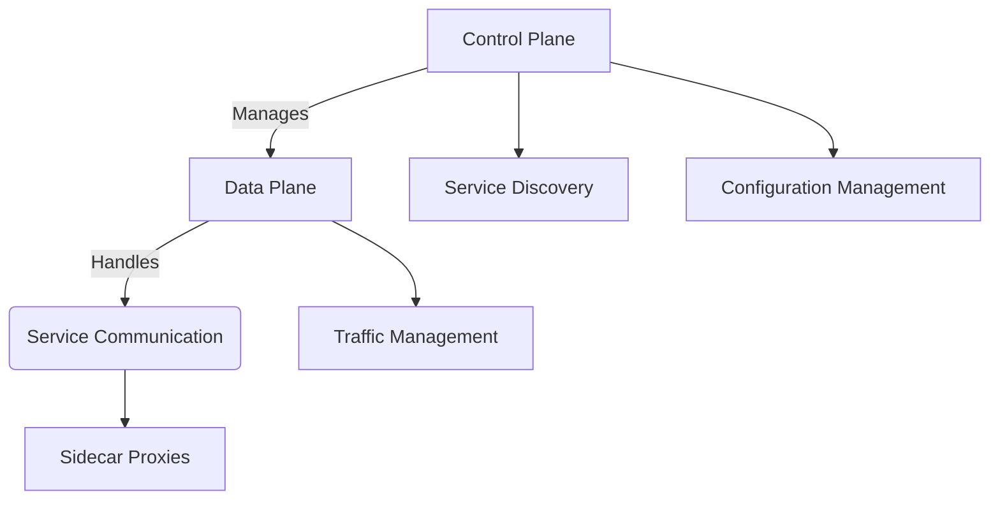

# Service Mesh Core Architecture

## Overview




## Key Components
- **Data Plane**: Handles service-to-service communication
- **Control Plane**: Manages proxy configuration and service discovery
- **Service Registry**: Maintains service endpoints (see [`src/security/management/configuration/security-config.ts`](../src/security/management/configuration/security-config.ts))

## Design Principles
```ts
// Example security policy from security-config.ts
interface MeshSecurityPolicy {
  mTLS: boolean;
  rateLimiting: {
    requestsPerSecond: number;
    burstCapacity: number;
  };
  accessControl: ServiceLevelAuthorization[];
}
```

## Best Practices
1. Enable automatic mTLS for service authentication
2. Use circuit breakers for fault tolerance
3. Implement progressive delivery strategies