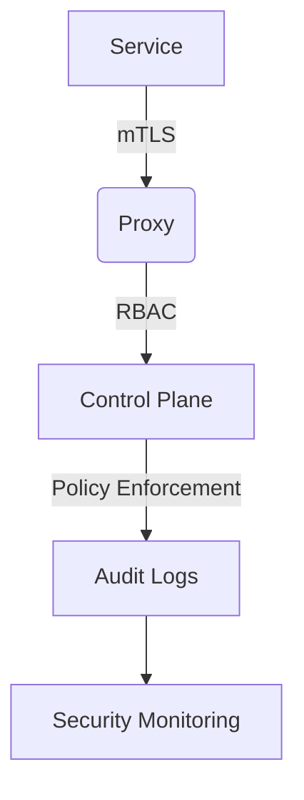

# Service Mesh Security

## Authentication
```ts
// From auth-service.ts
interface AuthConfig {
  provider: 'jwt'|'oauth2'|'mtls';
  jwtSecret?: string;
  certificateAuthority?: string;
  tokenExpiration: number;
}
```

## Certificate Management
```yaml
# Certificate rotation policy
certificates:
  rotation:
    interval: 90d
    autoRenew: true
    gracePeriod: 72h
  authorities:
    - name: mesh-ca
      secret: mesh-root-ca
      ttl: 8760h  # 1 year
```

## Policy Enforcement
```rego
# Example policy from policy-manager.ts
default allow = false

allow {
  input.method == "GET"
  input.path = "/api/v1/products"
  input.user.roles[_] == "viewer"
}

allow {
  input.method == "POST"
  input.path = "/api/v1/orders"
  input.user.roles[_] == "purchaser"
}
```

## Security Patterns


[Next: Observability →](../observability/telemetry-guide.md)