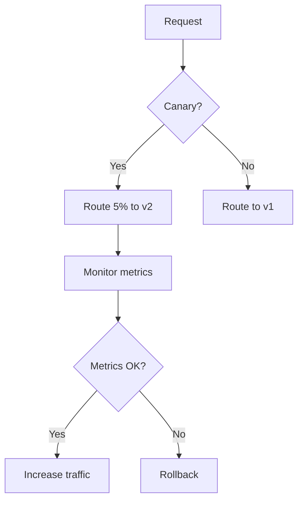

# Traffic Management Strategies

## Load Balancing
```ts
// From worker-scheduler.ts
const loadBalancingStrategies = {
  ROUND_ROBIN: 'round_robin',
  LEAST_CONN: 'least_connection', 
  RANDOM: 'random',
  HASH_BASED: (key: string) => `hash:${key}`
};
```

## Circuit Breaking
```yaml
# Circuit breaker configuration
circuit_breakers:
  default:
    maxConnections: 100
    maxPendingRequests: 50
    maxRequests: 200
    maxRetries: 3
  high_priority:
    maxConnections: 1000
    maxPendingRequests: 500
```

## Rate Limiting
```ts
// Implementation from rate-limiter.ts
export class RateLimiter {
  constructor(
    private readonly limit: number,
    private readonly interval: number
  ) {
    this.tokens = this.limit;
    setInterval(() => this.resetTokens(), this.interval);
  }
}
```

## Traffic Management Patterns


[Next: Security Features →](../features/security-guide.md)