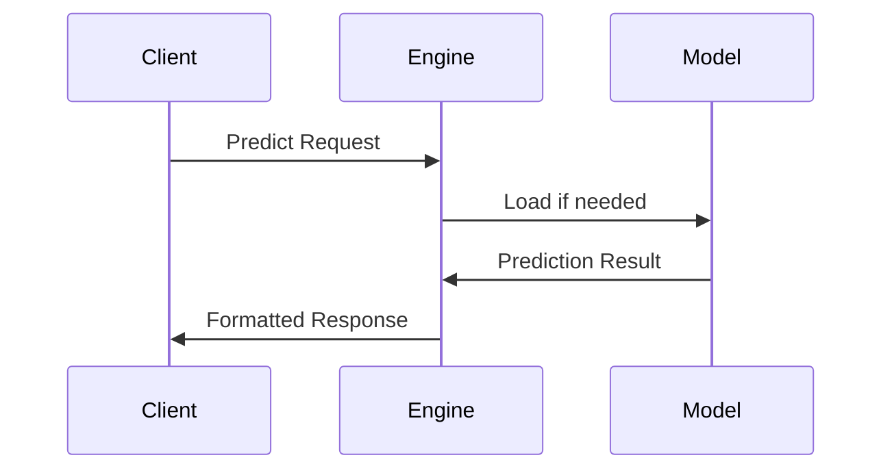

# ML Engine Guide

## Usage
The ML Engine provides model execution capabilities through:

```typescript
// Example from src/ml/__tests__/integration/realtime/inference-scheduler.spec.ts
const engine = new MLEngine({
  modelRegistry: new ModelRegistry(),
  resourceManager: new ResourceManager()
});
```

## Model Management
Key operations:
1. **Registration**:
   ```typescript
   engine.registerModel({
     id: 'sentiment-analysis',
     version: '1.0.0',
     path: './models/sentiment.onnx'
   });
   ```

2. **Versioning**:
   ```bash
   $ ml-engine list-models
   ```

## Inference Pipeline


## Performance Tuning
Configuration options in `config.json`:
```json
{
  "batchSize": 32,
  "threads": 4,
  "gpuAcceleration": true
}