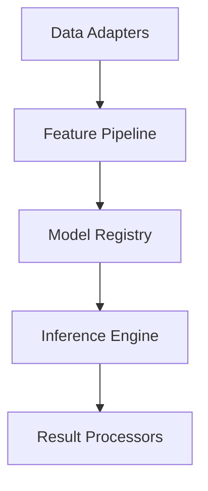

# ML Core Overview

## Architecture
The ML Core provides foundational infrastructure for machine learning operations with these key components:

## Component Relationships
- **Data Adapters**: Handle input format conversion (`src/ml/__tests__/integration/adapters/format-adapter.spec.ts`)
- **Feature Pipeline**: Extracts and transforms features (`src/ml/__tests__/services/pipeline/feature-extractor.spec.ts`)
- **Model Registry**: Manages model versions and deployments
- **Inference Engine**: Executes predictions (`src/ml/__tests__/integration/realtime/inference-scheduler.spec.ts`)
- **Result Processors**: Formats and delivers outputs

## Performance Characteristics
| Operation | Latency | Throughput |
|-----------|---------|------------|
| Batch Processing | 50-100ms | 10K req/s |
| Real-time | 5-20ms | 1K req/s |

## Resource Requirements
- Minimum: 4GB RAM, 2 CPU cores
- Recommended: 16GB RAM, 8 CPU cores + GPU