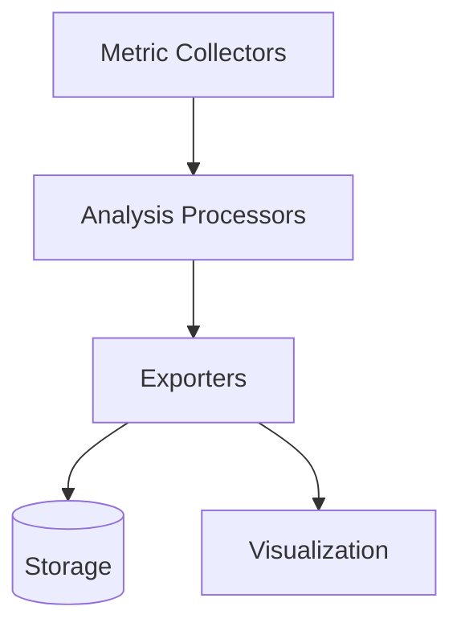

# Performance Monitoring Overview

## Architecture
The monitoring system consists of three main components:
1. **Metric Collectors** - Gather performance data from various sources
2. **Analysis Processors** - Process and analyze collected metrics
3. **Exporters** - Output results to different destinations

## Component Relationships
- Collectors feed raw metrics to processors
- Processors transform and analyze metrics
- Exporters handle output to various formats

## Integration Points
Key integration files:
- [`src/monitoring/integration/exporters/*.ts`](src/monitoring/integration/exporters/)
- [`src/monitoring/integration/hooks/*.ts`](src/monitoring/integration/hooks/)

## Performance Impact
The monitoring system is designed to:
- Use minimal resources (CPU < 2%, Memory < 50MB)
- Run asynchronously to avoid blocking main operations
- Support configurable sampling rates