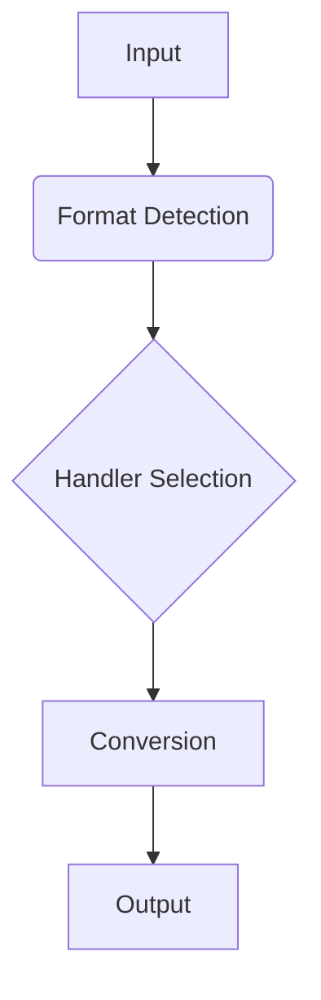

# Phase 3 Architecture Plan

## System Extensions
1. **Format Processing Pipeline**:

2. **Memory Management**:
- Implement chunked processing ([`src/formats/utils/chunk-processor.ts`](src/formats/utils/chunk-processor.ts))
- Stream-based operations
- Worker pool enhancements

## New Components
| Component | Purpose | Location |
|-----------|---------|----------|
| Template Engine | Document templating | `src/formats/templates/` |
| Batch Processor | Multi-file operations | `src/formats/batch/` |
| Quality Analyzer | Output validation | `src/formats/quality/` |

## Integration Points
1. **LLM Service**:
- Analysis integration ([`src/main/llm/ollama-connector.ts`](src/main/llm/ollama-connector.ts))
- Content suggestions
- Quality feedback

2. **Clipboard**:
- Advanced paste options
- Format negotiation
- Content transformation

## Performance Targets
| Metric | Target | Measurement |
|--------|--------|-------------|
| Conversion Time | < 100ms | Per-document |
| Memory Usage | < 50MB | Peak |
| Throughput | 10 docs/sec | Batch mode |

## Security Requirements
1. Input Validation:
- Strict format validation ([`src/formats/utils/format-validator.ts`](src/formats/utils/format-validator.ts))
- Content sanitization
- Size limits

2. IPC Security:
- Message signing
- Channel isolation
- Permission model