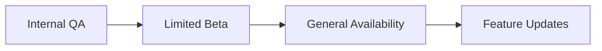

# Phase 3 Release Strategy

## Testing Phases
1. **Unit Testing**:
   - 95% coverage target
   - Focus on new format handlers
   - Reference: Existing test patterns ([`src/formats/__tests__/`](src/formats/__tests__/))

2. **Integration Testing**:
   - Cross-component workflows
   - Performance benchmarks
   - Stability testing

3. **User Acceptance**:
   - Beta program
   - Pilot deployments
   - Feedback collection

## Rollout Strategy

## Support Preparation
1. **Documentation**:
   - Updated user guides
   - Troubleshooting matrix
   - API references

2. **Training**:
   - Support staff workshops
   - Engineering runbooks
   - Known issue database

## Success Metrics
| Metric | Target | Measurement |
|--------|--------|-------------|
| Conversion Success | 99.5% | Error logs |
| Performance | < 150ms | Per operation |
| Uptime | 99.9% | Monitoring |