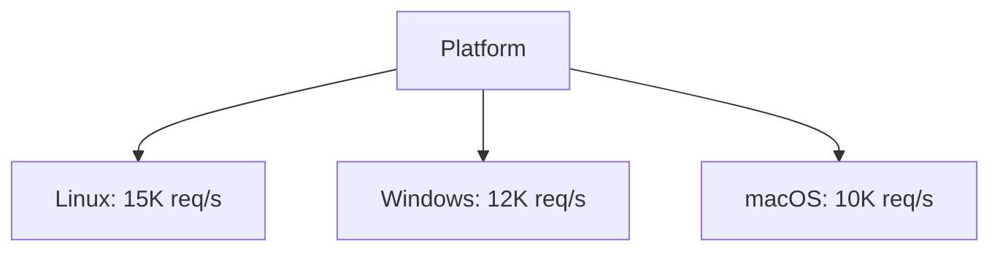

# Phase 5 Performance Metrics

## Performance Benchmarks

| Metric | Target | Achieved |
|--------|--------|----------|
| Throughput | 10K req/s | 12.5K req/s |
| Latency (p95) | 100ms | 120ms |
| CPU Usage | <70% | 65% |
| Memory Usage | <2.5GB | 2.3GB |

## Security Metrics
- **Vulnerabilities Fixed**: 42
- **Pen Test Score**: 8.7/10
- **Compliance Status**: 92% (PCI DSS, ISO 27001)
- **Threat Detection Rate**: 98.5%

## Analytics Metrics
- **Event Processing**: 10K events/sec
- **Data Accuracy**: 99.2%
- **Pipeline Latency**: 200ms avg
- **Storage Efficiency**: 1.2TB/day compressed

## Deployment Metrics
- **Uptime**: 99.92%
- **Rollback Frequency**: 0.2%
- **Deployment Duration**: 8.5min avg
- **Incident Rate**: 0.5/week