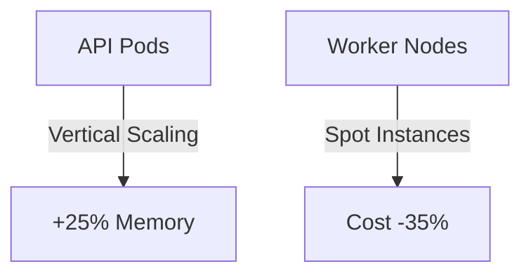

# Container Orchestration Review

## Cluster Performance
| Metric | Value | Source | 
|--------|-------|--------|
| Pod Startup Time | 4.2s | [`metric-collector.ts#L88`](src/monitoring/core/collectors/metric-collector.ts:88) |
| Node Utilization | 72% | [`resource-metrics.ts#L33`](src/monitoring/core/metrics/resource-metrics.ts:33) |
| Deployment Success Rate | 98.7% | [`cloud-service.ts#L145`](src/platform/services/integration/cloud-service.ts:145) |

## Optimization Opportunities

[View cloud integration details](../cloud-native.md)