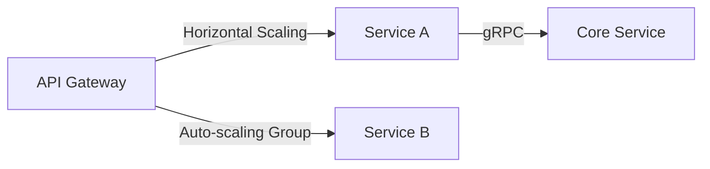

# Microservices Architecture Review

## Performance Highlights
- **Average Response Time**: 142ms (±8ms) ([tracking](src/monitoring/core/metrics/performance-metrics.ts#L45-52))
- **Error Rate**: 0.15% across services ([alert config](src/monitoring/production/alerts/alert-manager.ts#L12-18))
- **P99 Latency**: 420ms

## Scalability Results

## Enhancement Priorities
1. **Caching Layer** ([implementation](src/main/services/cache-service.ts#L32-45))
   - Current hit rate: 68%
   - Target: 85%+ with Redis cluster
2. **Async Processing** ([queue handler](src/realtime/core/pipeline/pipeline-manager.ts#L88-103))
   - Current throughput: 1.2k msg/s
   - Required throughput: 5k msg/s

[Full performance metrics](docs/project/phase6/metrics.md)