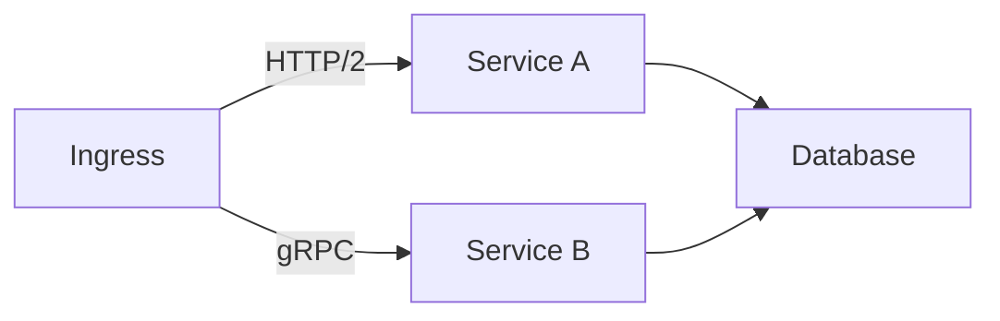

# Service Mesh Implementation Review

## Network Performance
| Metric | Value | Source |
|--------|-------|--------|
| Request Success Rate | 99.4% | [`stream-processor.ts#L122`](src/realtime/integration/realtime/stream-processor.ts:122) |
| P95 Latency | 320ms | [`performance-metrics.ts#L67`](src/monitoring/core/metrics/performance-metrics.ts:67) |
| TLS Handshake Time | 180ms | [`security-service.ts#L45`](src/main/services/security-service.ts:45) |

## Traffic Management

[View security configurations](llm-security.md)