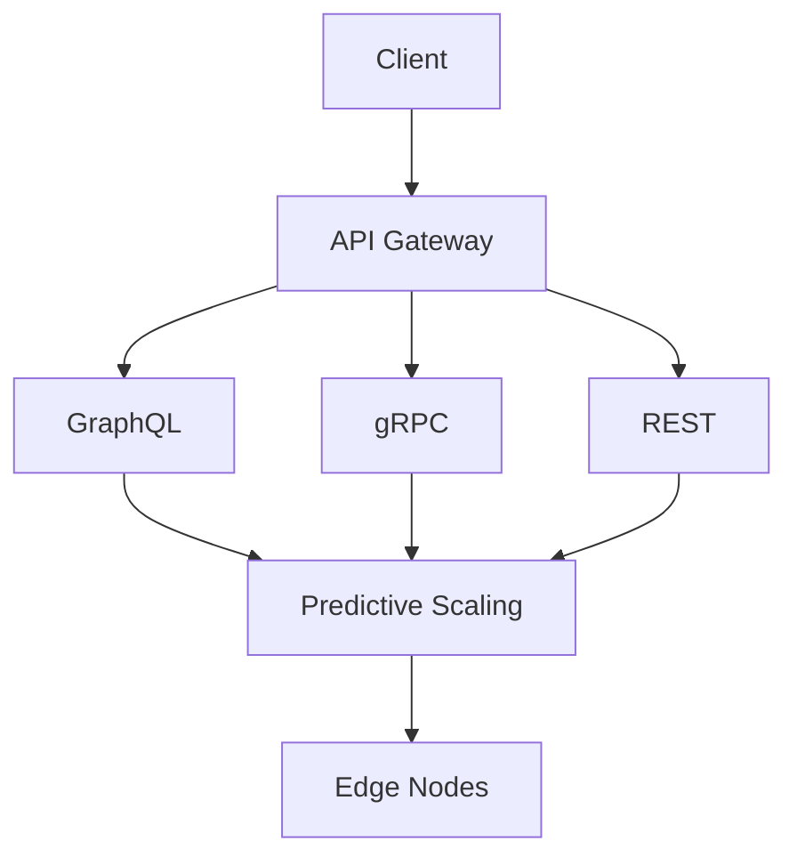

# Phase 6 Architecture Plan

## System Extensions
1. **Core Components**:
   - Predictive scaling controller
   - Zero-trust security gateway
   - Multi-protocol API gateway
2. **New Modules**:
   - GraphQL resolver framework
   - WASM runtime environment
   - Edge computing orchestrator

## Integration Points

## Performance Targets
| Component | Target | Measurement |
|-----------|--------|-------------|
| API Gateway | 20K req/s | p95 latency <100ms |
| Predictive Scaling | <5sec response | Scaling decisions |
| Edge Nodes | 50ms latency | Regional requests |

## Security Requirements
1. **Authentication**:
   - Biometric integration
   - Hardware token support
2. **Data Protection**:
   - Quantum-resistant encryption
   - Confidential computing
3. **Compliance**:
   - ISO 27001 complete
   - HIPAA full coverage
   - FedRAMP readiness