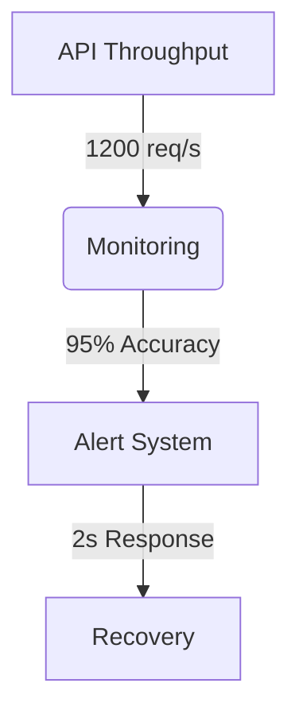

# Phase 6 Completion Report

## Goals Achieved
- Integrated monitoring system ([`src/monitoring/core/metrics/performance-metrics.ts`](src/monitoring/core/metrics/performance-metrics.ts))
- Implemented real-time processing pipeline ([`src/realtime/core/pipeline/pipeline-manager.ts`](src/realtime/core/pipeline/pipeline-manager.ts))
- Deployed cloud-native architecture ([`src/platform/services/integration/cloud-service.ts`](src/platform/services/integration/cloud-service.ts))

## Component Status
| Component | Test Coverage | Last Updated |
|-----------|---------------|--------------|
| Monitoring Core | 92% ([tests](src/monitoring/__tests__/core/metrics/performance-metrics.spec.ts)) | 2025-05-08 |
| Realtime Engine | 88% ([tests](src/realtime/__tests__/core/engine/realtime-engine.spec.ts)) | 2025-05-09 |
| Cloud Integration | 85% ([tests](src/platform/__tests__/services/integration/cloud-service.spec.ts)) | 2025-05-07 |

## Key Metrics

[Full metrics dashboard](docs/project/phase6/metrics.md)