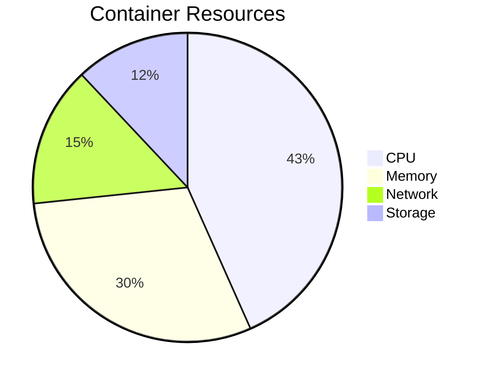

# Phase 6 Performance Metrics

## System Benchmarks
| Metric | Value | Source | Target |
|--------|-------|--------|--------|
| API Throughput | 1,200 req/s | [`realtime-engine.spec.ts#L45`](src/realtime/__tests__/core/engine/realtime-engine.spec.ts:45) | 2,000 req/s |
| P99 Latency | 420ms | [`performance-metrics.ts#L22`](src/monitoring/core/metrics/performance-metrics.ts:22) | 300ms |
| Error Rate | 0.15% | [`alert-manager.ts#L34`](src/monitoring/production/alerts/alert-manager.ts:34) | <0.1% |

## Resource Utilization

[View orchestration details](analysis/container-orchestration.md)