# Serverless Architecture Analysis

## Function Metrics
| Function Type      | Invocations | Avg Duration | Errors | Cost/Month |
|--------------------|-------------|--------------|--------|------------|
| Data Processing    | 1.2M        | 320ms        | 0.12%  | $142.50    |
| API Gateway        | 4.8M        | 85ms         | 0.08%  | $89.20     |
| Event Handlers     | 650K        | 210ms        | 0.25%  | $67.80     |

## Scaling Performance

```mermaid
gantt
    title Scaling Events Last Month
    dateFormat  HH:mm
    section Cold Starts
    API Gateway : 08:00, 30m
    Data Processor : 14:00, 45m
    section Scale-down
    API Gateway : 22:00, 20m
    Event Handlers : 23:30, 15m
```

## Optimization Opportunities
1. Implement provisioned concurrency for critical paths
2. Optimize library imports to reduce package size
3. Enable ARM architecture for compatible functions