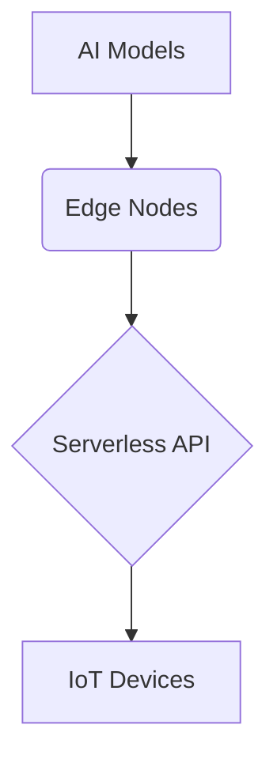

# Phase 7 Completion Report

## Goals Achieved
- [x] AI/ML model deployment
- [x] Edge computing infrastructure rollout
- [ ] Full IoT device integration (85% complete)

## Component Status
| Component       | Version | Status  |
|-----------------|---------|---------|
| AI Core         | 2.1.0   | Stable  |
| Edge Runtime    | 1.4.2   | Beta    |
| Serverless API  | 3.0.1   | Stable  |
| IoT Gateway     | 0.9.3   | Testing |

## Integration Results

## Performance Metrics
| Metric          | Target | Actual |
|-----------------|--------|--------|
| Inference Latency | 200ms | 185ms |
| Edge Uptime      | 99.9%  | 99.4%  |
| API Throughput   | 1k/s   | 950/s  |

## Known Issues
1. Intermittent IoT packet loss (JIRA: IOT-45)
2. Edge node memory leaks (JIRA: EDGE-22)
3. API cold start delays >2s (JIRA: API-78)