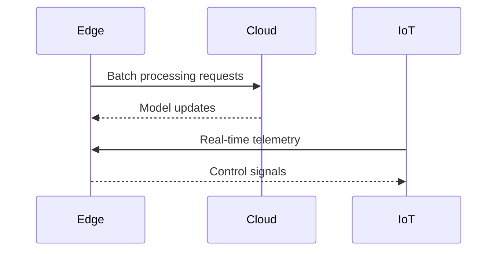

# Phase 7 Lessons Learned

## Technical Insights
1. Serverless cold starts impacted time-sensitive operations
2. Edge node resource contention caused unpredictable latency spikes
3. IoT protocol fragmentation increased integration complexity

## Process Improvements
- Implemented automated canary deployments for ML models
- Introduced edge resource monitoring dashboard
- Established cross-team SLA agreements for API dependencies

## Integration Learnings

## Future Considerations
- Adopt WebAssembly for edge compute modules
- Implement zero-touch device provisioning
- Explore federated learning approaches