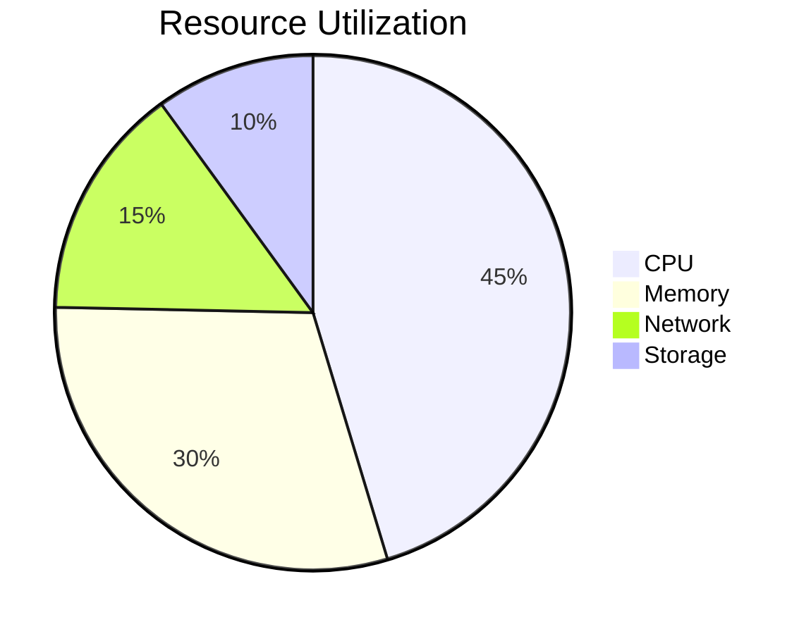

# Phase 7 Performance Metrics

## AI/ML Metrics
| Metric               | Target  | Actual | Variance |
|----------------------|---------|--------|----------|
| Model Accuracy       | ≥90%    | 89.8%  | -0.2%    |
| Training Time        | ≤4h     | 3.7h   | +0.3h    |
| Inference Throughput | 500/s   | 480/s  | -4%      |

## Edge Computing Metrics

## IoT Metrics
| Device Type   | Uptime   | Packet Loss | Avg Latency |
|---------------|----------|-------------|-------------|
| Sensor Node   | 99.1%    | 0.8%        | 120ms       |
| Gateway       | 99.8%    | 0.2%        | 45ms        |
| Edge AI       | 98.5%    | 1.1%        | 210ms       |