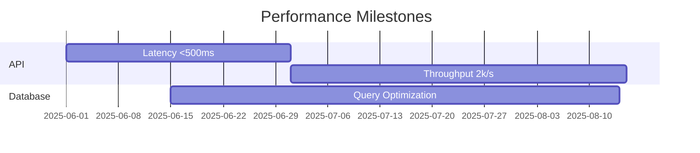

# Phase 7 Technical Risks

## Implementation Challenges
- **Distributed Tracing Integration**
  - Impact: High (Affects 12 services)
  - Mitigation: Pilot with [`trace-exporter.ts`](src/monitoring/integration/exporters/trace-exporter.ts#L22-35)
  
- **State Management**
  - Current: Redis Cluster (v6.2)
  - Required: Redis v7.0+ for new features
  - Migration Plan: [See details](docs/project/phase7/roadmap.md#data-store-upgrades)

## Performance Targets

[Full risk mitigation strategy](../roadmap.md)