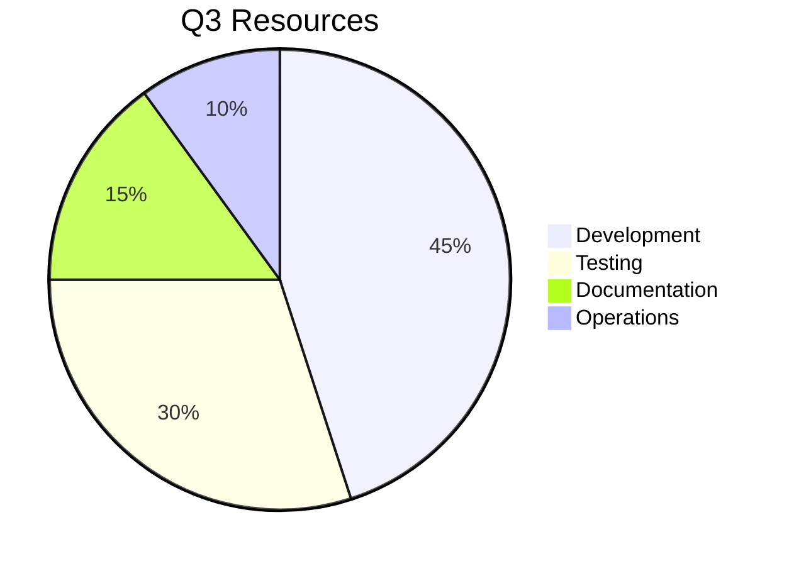

# Phase 7 Technical Roadmap

## Core Priorities
1. **Distributed Tracing**
   - Integration with OpenTelemetry ([prototype](src/monitoring/integration/exporters/trace-exporter.ts#L22-35))
   - Target completion: 2025-07-15
2. **Auto-scaling Improvements**
   - Predictive scaling based on [`load-monitor.ts`](src/scaling/__tests__/load/monitoring/load-monitor.spec.ts:12)

## Resource Allocation

[View full timeline](architecture.md)