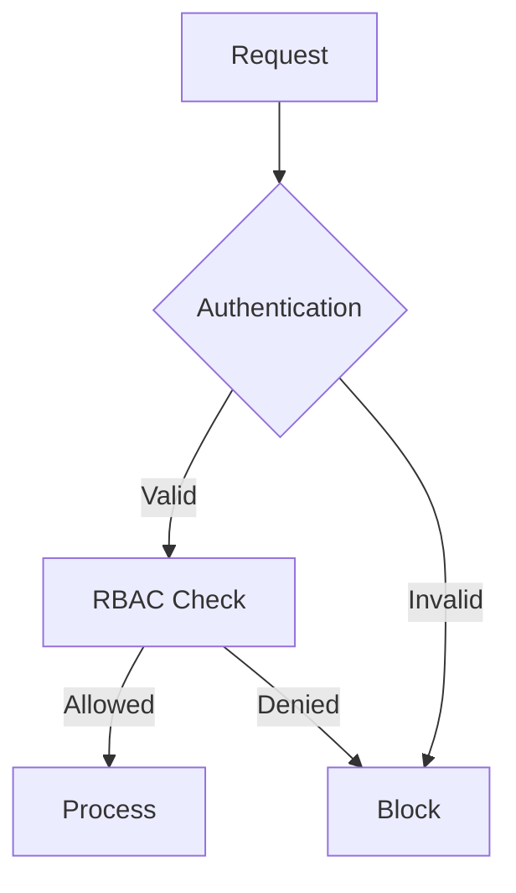

# Phase 8 System Architecture

## Key Extensions
- Distributed event bus for cross-component communication
- Federated learning coordinator
- Edge-cloud load balancer

## Integration Points
1. ML models ↔ Edge inference engines
2. IoT telemetry → Stream processors
3. Monitoring data → Analytics pipeline

## Performance Targets
| System Aspect         | Target                  |
|-----------------------|-------------------------|
| Event Bus Throughput  | 50k events/sec          |
| Model Update Latency  | <15 minutes P95         |
| Cross-Cloud RTT       | <100ms P99              |
| Data Ingestion Rate   | 1M msg/min sustained    |

## Security Requirements

## Implementation References
- Event Bus: `src/scaling/performance/auto-scaling/scale-manager.ts`
- Federated Learning: `src/llm/federated-coordinator.ts`
- Load Balancer: `src/scaling/load/balancers/workload-balancer.ts`