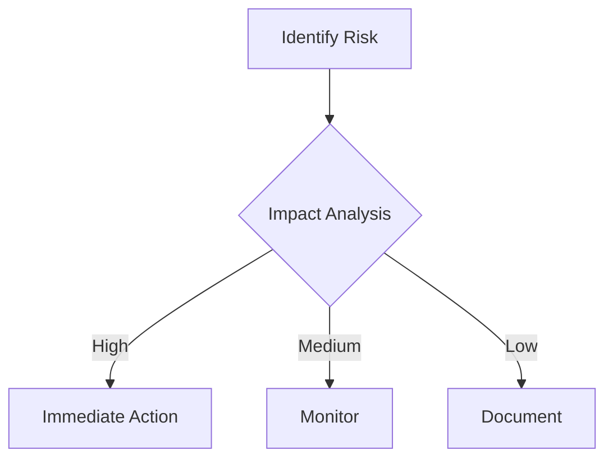

# Project Risk Assessment

## Resource Constraints
- Limited ML engineering capacity (3 FTE vs required 5)
- Cloud budget capped at $12k/month
- Edge device procurement lead time (8-12 weeks)

## Timeline Risks
| Milestone         | Buffer Days | Critical Path Dependencies       |
|-------------------|-------------|-----------------------------------|
| Core API Launch   | 7           | Cloud provisioning team delivery |
| ML Model Deployment | 10        | Training data collection         |
| Edge Rollout      | 14          | Hardware certification           |

## Dependency Risks
1. Third-party API rate limits (Mitigation: Cache layer implementation)
2. Cloud provider regional outages (Mitigation: Multi-region deployment)
3. Device firmware compatibility (Mitigation: Compatibility test suite)

## Mitigation Plans
1. Implement capacity monitoring dashboard (`src/monitoring/capacity-monitor.ts`)
2. Establish vendor escalation channels
3. Maintain 20% sprint capacity for unplanned work