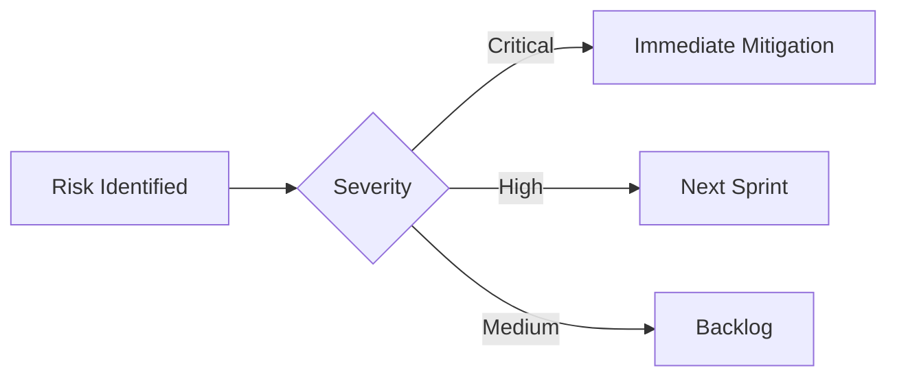

# Technical Risk Assessment

## Implementation Challenges
1. Distributed transaction consistency
2. Real-time model version synchronization
3. Heterogeneous device management

## Performance Concerns
| Risk Area          | Probability | Impact | Mitigation Strategy              |
|--------------------|-------------|--------|-----------------------------------|
| Network Saturation | Medium      | High   | Implement QoS prioritization      |
| Memory Leaks       | Low         | High   | Add automated heap analysis       |
| Data Consistency   | High        | Medium | Use CRDTs for eventual consistency|

## Security Considerations
- Implement zero-trust architecture for edge nodes
- Add runtime integrity verification
- Enforce mutual TLS for all inter-service communication