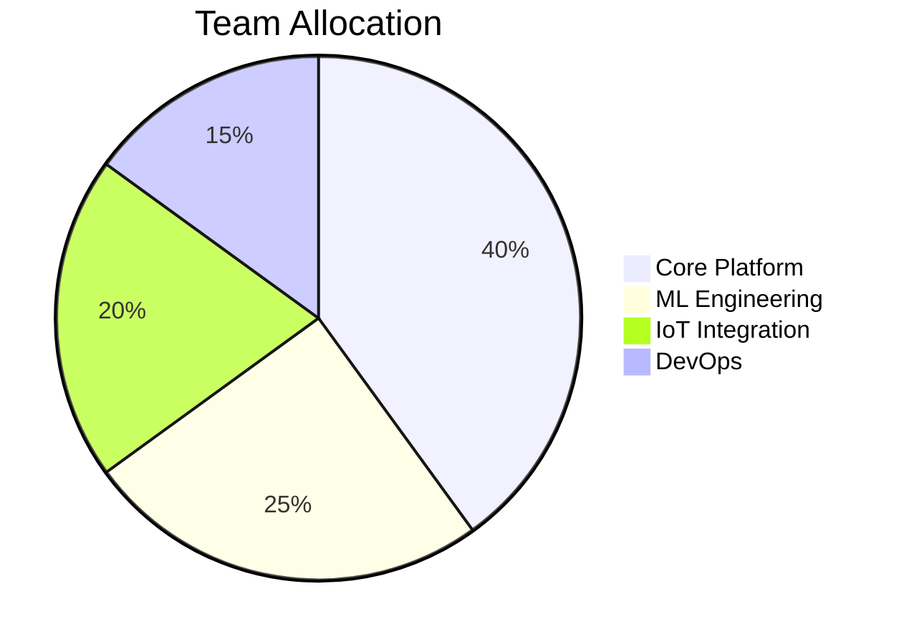

# Phase 8 Development Roadmap

## Feature Priorities
1. Real-time anomaly detection pipeline
2. Automated scaling governor
3. Unified device management console

## Technical Requirements
| Component       | Specification              | Deadline     |
|-----------------|----------------------------|--------------|
| Streaming API   | 10k msg/s throughput       | Q3 2025      |
| ML Orchestrator | Sub-100ms decision latency | Q4 2025      |
| Edge Runtime    | ARM64v9 compatibility      | Q1 2026      |

## Resource Planning

## Timeline
- Q3 2025: Foundation layer complete
- Q4 2025: Core features operational
- Q1 2026: Full ecosystem integration