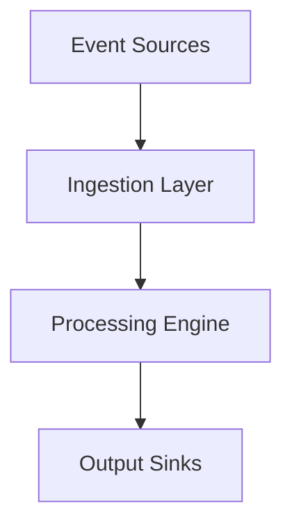

# Real-time Processing Core Overview

## Architecture
The real-time processing system follows a modular pipeline architecture with these key components:

1. **Event Sources** - Input streams from various sources
2. **Ingestion Layer** - Receives and normalizes incoming data
3. **Processing Engine** - Core real-time computation framework
4. **Output Sinks** - Destination systems for processed data

## Component Relationships
- **Engine ↔ Streams**: The engine manages multiple parallel streams
- **Streams ↔ Processors**: Each stream contains a chain of processors
- **Processors ↔ Services**: Processors utilize shared services (monitoring, coordination)

## Performance Characteristics
| Metric | Target | Notes |
|--------|--------|-------|
| Latency | <5ms | 99th percentile |
| Throughput | 50K events/sec | Per node |
| Recovery Time | <1s | Failover duration |

## Resource Requirements
| Component | CPU | Memory | Storage |
|-----------|-----|--------|---------|
| Engine Core | 2 cores | 4GB | 500MB |
| Stream Processor | 1 core/stream | 1GB/stream | 100MB/stream |
| Coordination | 0.5 cores | 2GB | 50MB |