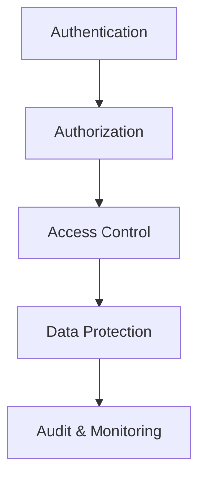

# Security Architecture Overview

## Design Principles
- **Defense in Depth**: Multiple layers of security controls
- **Least Privilege**: Minimal permissions required
- **Zero Trust**: Verify explicitly, never trust implicitly
- **Secure by Default**: Safe configurations out-of-the-box

## Component Relationships

## Security Model
- **Authentication**: [`src/security/core/authentication/auth-service.ts`](src/security/core/authentication/auth-service.ts)
- **Authorization**: [`src/security/core/authorization/role-manager.ts`](src/security/core/authorization/role-manager.ts)
- **Session Management**: [`src/security/core/authentication/session-manager.ts`](src/security/core/authentication/session-manager.ts)