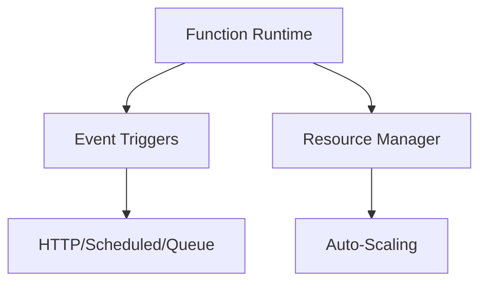

# Serverless Architecture Overview

## Core Components


### Key Relationships
- **Function Deployer** ([`function-deployer.ts`](src/serverless/core/deployment/function-deployer.ts)) handles containerization
- **Lifecycle Manager** ([`lifecycle-manager.ts`](src/serverless/core/runtime/lifecycle-manager.ts)) manages cold starts
- **Context Binding** ([`context-binding.spec.ts`](src/serverless/__tests__/integration/bindings/context-binding.spec.ts:1)) handles runtime injections

## Design Principles
1. Event-driven execution model
2. Stateless function design
3. Horizontal auto-scaling
4. Pay-per-use resource allocation

```typescript
// Example function template
export async function handler(
  event: EventPayload,
  context: ExecutionContext
): Promise<Response> {
  const config = await context.config.get('env');
  return new Response(JSON.stringify(config));
}
```

## Best Practices
- Keep functions under 15s runtime
- Use environment variables for configuration
- Implement proper error handling
- Monitor cold start metrics