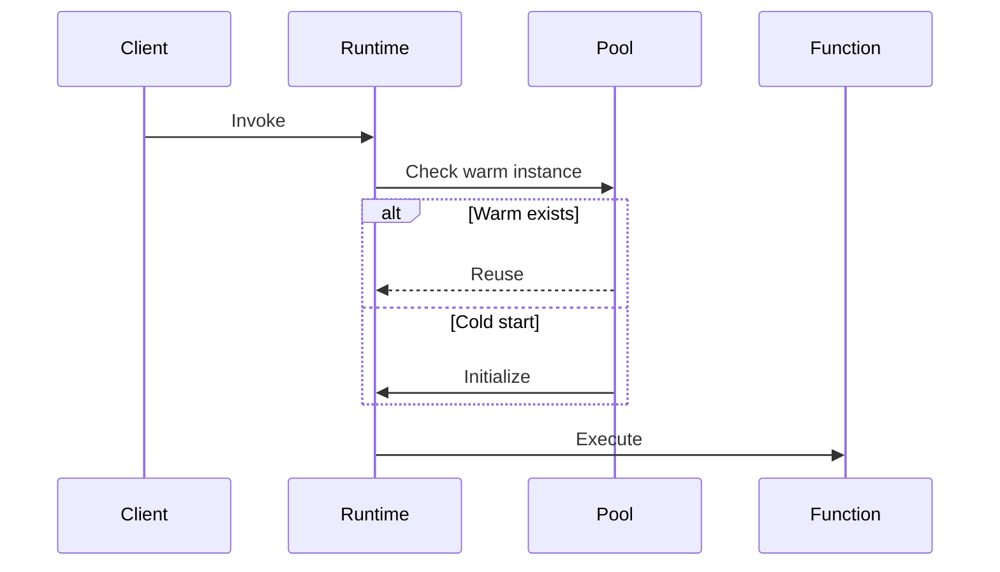

# Serverless Runtime Guide

## Function Runtime Setup
```typescript
// function-runtime.ts initialization
import { LifecycleManager } from './lifecycle-manager';

export class FunctionRuntime {
  constructor(
    private lifecycleManager: LifecycleManager = new LifecycleManager()
  ) {
    this.initializeColdStartPool();
  }
}
```

## Context Management
- **Execution Context** ([`context-manager.ts`](src/serverless/core/runtime/context-manager.ts:1))
  - Environment variables
  - Request metadata
  - Connection pools

## Lifecycle Handling


## Performance Tuning
| Parameter         | Recommendation | Config Reference                   |
|-------------------|----------------|-------------------------------------|
| Memory            | 512MB-1GB      | `resource-allocator.spec.ts`        |
| Timeout           | <30s           | `function-executor.ts`              |
| Concurrency       | 10-100         | `concurrency-manager.spec.ts`       |