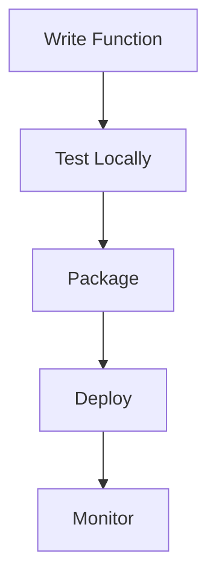

# Getting Started with Serverless

## Initial Setup
```bash
npm install @serverless/core
sls init my-function
```

## Basic Function
```typescript
// index.ts
export const handler = async (event: any) => {
  return {
    statusCode: 200,
    body: JSON.stringify({ message: "Hello Serverless" })
  };
};
```

## Deployment Workflow


## Common Patterns
- **API Gateway Proxy** ([`http-trigger.ts`](src/serverless/services/triggers/http-trigger.ts))
- **Scheduled Task** ([`schedule-trigger.spec.ts`](src/serverless/__tests__/services/triggers/schedule-trigger.spec.ts))
- **File Processing** ([`storage-connector.spec.ts`](src/serverless/__tests__/integration/connectors/storage-connector.spec.ts))

```bash
# Deploy to staging
sls deploy --stage staging
```

[Best practices reference](./best-practices.md)