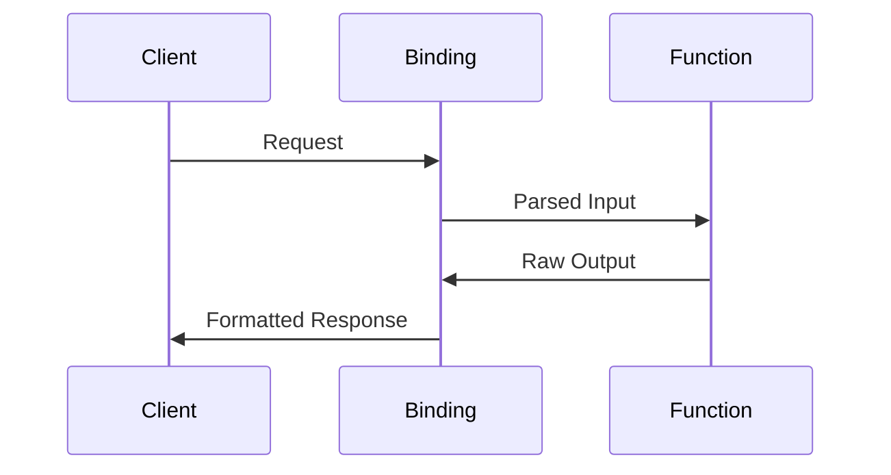

# Context Bindings Guide

## Input/Output Handling
```typescript
// input-binding.spec.ts example
test('binds JSON payload', () => {
  const binding = new InputBinding();
  const data = binding.transform('{"key":"value"}');
  expect(data).toEqual({ key: 'value' });
});

// output-binding.spec.ts example
test('serializes response', () => {
  const binding = new OutputBinding();
  const result = binding.format({ status: 'success' });
  expect(result).toBe('{"status":"success"}');
});
```

## Binding Configuration
```yaml
# function-config.yaml
bindings:
  - name: database
    type: postgres
    poolSize: 10
  - name: storage
    type: s3
    bucket: my-app-data
```

## Context Binding Patterns


| Binding Type     | Implementation File                   | Test Coverage               |
|------------------|---------------------------------------|-----------------------------|
| Database         | `database-connector.spec.ts`          | Connection pooling          |
| Service          | `service-connector.spec.ts`           | API integration             |
| Context          | `context-binding.spec.ts`             | Runtime injection           |

[Service connectors reference](./connectors-guide.md)