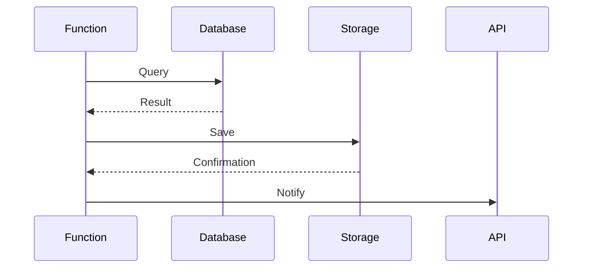

# Service Connectors Guide

## Storage Integration
```typescript
// storage-connector.spec.ts example
test('uploads to cloud storage', async () => {
  const connector = new StorageConnector('bucket-name');
  await connector.upload('test.txt', Buffer.from('data'));
  expect(mockStorage.upload).toBeCalled();
});
```

## Database Access Patterns
| Pattern          | Use Case                  | Implementation File                   |
|------------------|---------------------------|---------------------------------------|
| Connection Pool  | High concurrency          | `database-connector.spec.ts`          |
| ORM Integration  | Data modeling             | `service-connector.spec.ts`           |
| Transaction      | Atomic operations         | `context-binding.spec.ts`             |

## Service Integration


[Binding configuration reference](./bindings-guide.md)