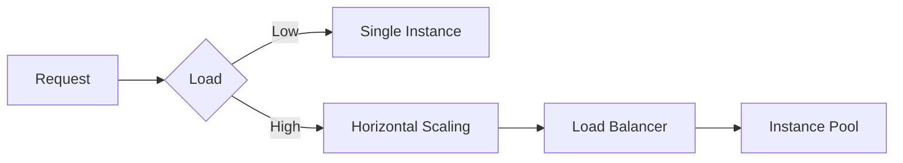

# Function Execution Guide

## Concurrency Control
```typescript
// concurrency-manager.spec.ts example
test('limits parallel executions', async () => {
  const manager = new ConcurrencyManager(5);
  await Promise.all(Array(10).fill(0).map(() => manager.acquire()));
  expect(manager.activeSlots).toBe(5);
});
```

## Resource Allocation
| Resource        | Configuration File                   | CLI Flag         |
|-----------------|--------------------------------------|------------------|
| Memory          | `resource-allocator.ts`              | `--memory 1024`  |
| CPU             | `function-deployer.ts`               | `--cpu 2`        |
| Timeout         | `function-executor.ts`               | `--timeout 30`   |

## Scaling Patterns


[Performance optimization reference](../utils/optimization-guide.md)