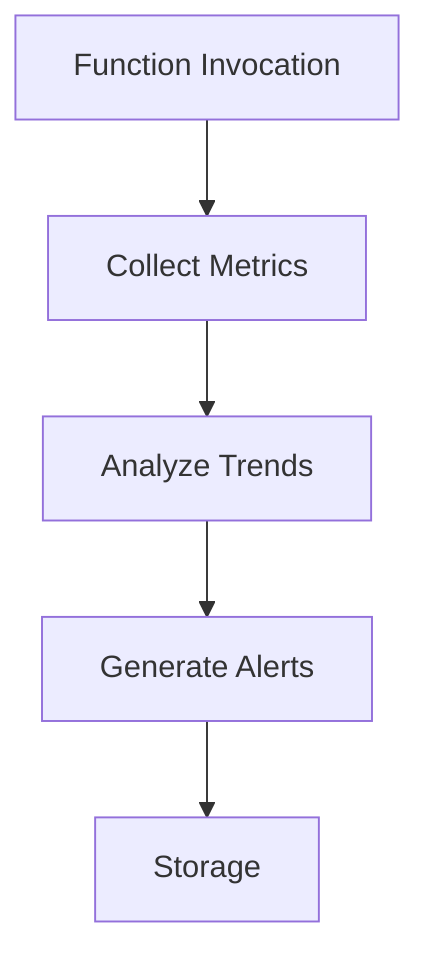

# Serverless Monitoring Guide

## Execution Tracking
```typescript
// execution-monitor.spec.ts example
test('tracks function duration', async () => {
  const monitor = new ExecutionMonitor();
  await monitor.track(() => sleep(100));
  expect(monitor.lastDuration).toBeGreaterThan(99);
});
```

## Performance Metrics
| Metric            | Collection Frequency | Implementation File                   |
|--------------------|----------------------|---------------------------------------|
| Cold Start Rate    | Per invocation       | `cold-start-optimizer.spec.ts`        |
| Memory Usage       | 5s intervals         | `memory-optimizer.spec.ts`            |
| Error Rate         | Real-time            | `function-executor.ts`                |



## Cost Tracking
```bash
# Cost estimation command
sls cost --function myFunction --memory 1024 --duration 100ms
```

[Alert configuration reference](../production/alerts/alert-manager.ts)