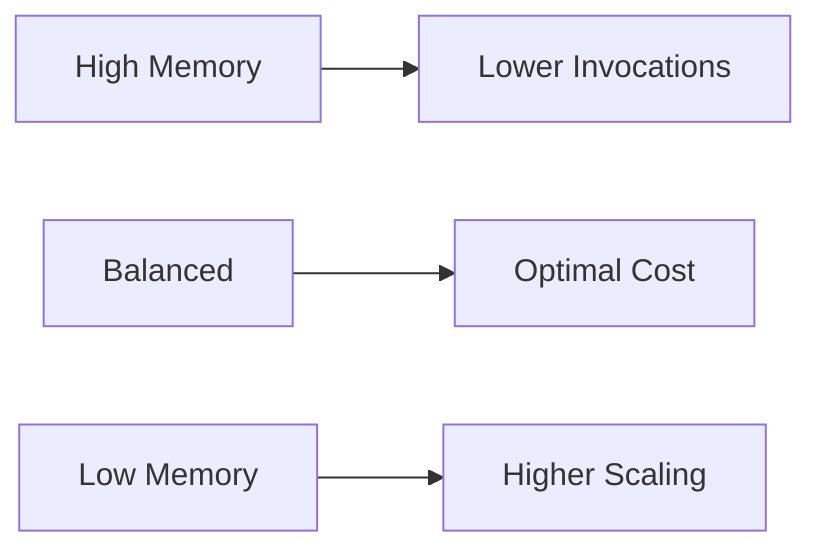

# Serverless Optimization Guide

## Cold Start Mitigation
```typescript
// cold-start-optimizer.spec.ts example
test('maintains warm pool', async () => {
  const optimizer = new ColdStartOptimizer();
  await optimizer.keepWarm(5);
  expect(optimizer.poolSize).toBe(5);
});
```

## Memory Management
| Strategy         | Implementation File                   | CLI Flag          |
|------------------|---------------------------------------|-------------------|
| Tiered Allocation| `memory-optimizer.spec.ts`            | `--memory-tiered` |
| Garbage Control  | `resource-allocator.ts`               | `--gc-interval`   |



## Auto-Scaling Configuration
```yaml
# scaling-config.yaml
autoScale:
  minInstances: 2
  maxInstances: 20
  cpuThreshold: 70
  scaleOutCooldown: 120
```

[Performance metrics reference](./monitoring-guide.md#performance-metrics)