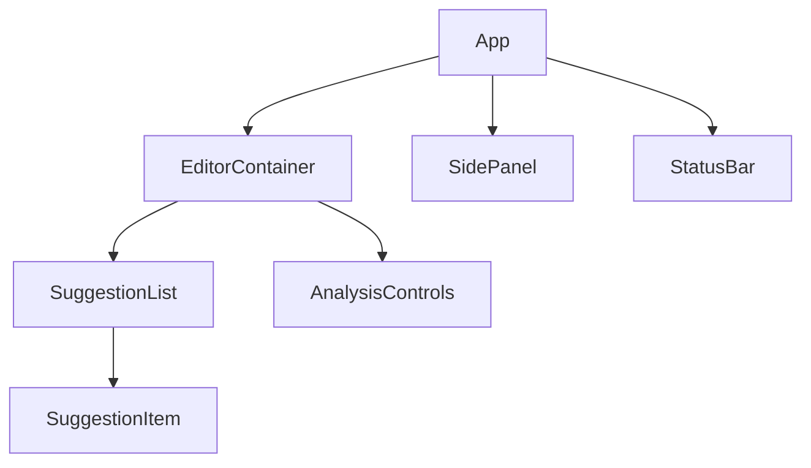

# UI Components Overview

## Component Hierarchy


## State Flow
The UI components follow a unidirectional data flow:

1. **User Interaction** triggers actions
2. **Actions** update the Redux store
3. **Store changes** propagate to components
4. **Components** re-render with new state

```typescript
// From src/renderer/components/app/EditorContainer.tsx
const EditorContainer: React.FC = () => {
  const content = useSelector(selectEditorContent);
  const dispatch = useDispatch();

  const handleContentChange = (newContent: string) => {
    dispatch(editorActions.contentUpdated(newContent));
  };

  return <MonacoWrapper content={content} onChange={handleContentChange} />;
};
```

## Key Components

### EditorContainer
- Wraps Monaco editor
- Manages editor lifecycle
- Coordinates with suggestion system

### SidePanel
- Displays analysis controls
- Shows document statistics
- Configuration options

### StatusBar
- Shows current editor state
- Displays analysis progress
- Error notifications

## Event Handling
Events are processed through:

1. **DOM Events** → Component Handlers
2. **Component Handlers** → Redux Actions
3. **Actions** → Reducers → Store Update

```typescript
// From src/renderer/components/suggestions/SuggestionList.tsx
const SuggestionList: React.FC = () => {
  const suggestions = useSelector(selectActiveSuggestions);
  
  const handleSuggestionClick = (suggestion: Suggestion) => {
    dispatch(editorActions.applySuggestion(suggestion));
  };

  return (
    <ul>
      {suggestions.map(suggestion => (
        <SuggestionItem 
          key={suggestion.id}
          suggestion={suggestion}
          onClick={handleSuggestionClick}
        />
      ))}
    </ul>
  );
};
```

## Performance Considerations
1. Use React.memo for pure components
2. Memoize selectors with createSelector
3. Virtualize long lists (e.g., suggestions)
4. Debounce frequent events

## Related Documentation
- [Editor Container](./editor-container.md)
- [Suggestion System](./suggestion-system.md)
- [State Management](../editor/state-management.md)